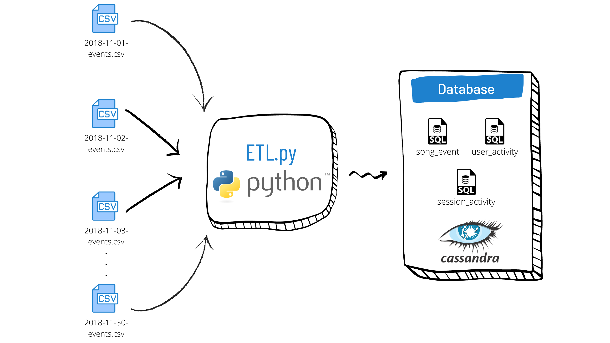

# Modelagem de dados com Cassandra

## Introdução

Esse é um projeto para praticar modelagem de dados com Cassandra e desenvolvimento de dashboards com Metabase.

Esse projeto ajuda o time de analytics de uma startup chamada Sparkify analisando seus dados de músicas e as atividades de usuários.

Os dado contidos em um diretório com arquivos CSV particionados por data são transferidos para uma base de dados para análises futuras. 

## ETL Pipeline

Sparkify deseja analisar quais músicas os seus usários estão escutando.

Utilizando os conjuntos de dados event_datafile.csv, foi criada uma base de dados com as seguintes tabelas

- song_event
- user_activity
- session_activity

O ETL pipeline extrai os dados dos arquivos CSV contidos no diretório event_data, que estão particionados pela data, e com isso é criado o arquivo `event_datafile.csv`. Em seguida é feita a inserção nas tabelas do Cassandra utilizando o script `etl.py`, como você pode observar na imagem abaixo

## Como executar

### Pré-requisitos

Se você deseja executar esse projeto em sua máquina, você deve finalizar os seguintes passos primeiro.

- Instalar `Cassandra` em localhost
- Criar usuário `cassandra` com senha `admin`
- Criar base de dados `sparkifydb`
- Instalar `Metabase`

### Instruções

1. Criar database/tabelas: `python create_tables.py`
2. Enviar os dados dos arquivos, armazenando na base de dados: `python etl.py`
3. Confira o resultado do processo: Execute as queries, individualmente, do arquivo `test.sql` no Cassandra para visualizar se os dados foram registrados corretamente nas tabelas
4. Dashboard

## Arquivos do projeto

- **data**
  - **event_datafile**
    - diretório com arquivos CSV particionados por data
- **images**
  - Imagens do documento
- **create_tables.py**
  - Quando executado, esse script irá
    - `drop` database `sparkifydb`
    - `create` database `sparkifydb`
    - `drop` tables if exists
    - `create` tables if not exists
- **etl.py**
  - Script para implementaçao do processo de ETL
  - Quando executado, esse script irá 
    - Iterar entre todos arquivos dentro do diretório `event_datafile` para extrair os dados de eventos do app e inserir na base de dados do Cassandra
- **README.md**
  - Descrição e instruções sobre o projeto
- **sql_queries.py**
  - Contém todas instruções DLL definidas
- **test.sql**
  - Queries para testar se as tabelas foram populadas corretamente
- **arquivo do metabase**
  - Dashboard com as análises realizadas
